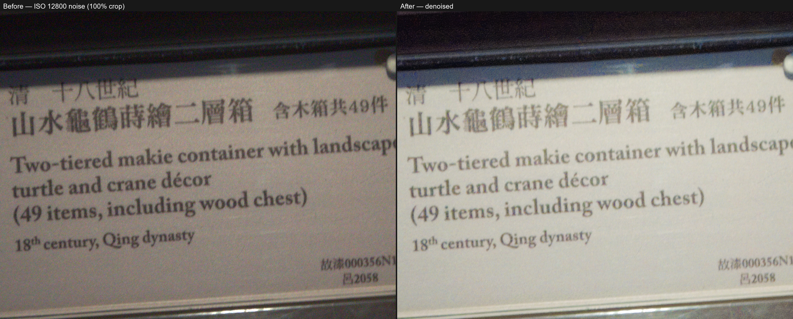

# RAW Photo Pipeline
### AI 全自動 RAW 相片批次處理工具 · Automated AI RAW Photo Processing Pipeline

批次處理 RAW 相片：AI 降噪、自動白平衡與曝光校正、AI 調色，並提供選用的
畫面放大功能。內建網頁介面，無需撰寫程式或使用命令列。完全在本機執行
（建議搭配 Windows + NVIDIA 顯卡），照片不會上傳至任何伺服器。

Batch-processes RAW photos through AI denoising, automatic white balance
and exposure correction, and AI color grading, with an optional upscaling
step. Ships with a local web UI — no coding or command-line use required.
Runs entirely on your own machine (Windows + NVIDIA GPU recommended); no
photo ever leaves your computer.

## 範例 Examples

**高 ISO 降噪 · High-ISO denoising**（ISO 12800，博物館展場無閃光燈拍攝，
100% 原始像素裁切 · museum exhibit, no flash, 100% pixel crop）



## 功能 Features

- **AI 降噪 · AI Denoising**：採用 [NAFNet](https://github.com/megvii-research/NAFNet)，
  對高 ISO 雜訊有良好抑制效果；搭配切塊（tiled）推論，大尺寸照片也能在
  消費級顯卡的 VRAM 限制下處理，並修正了常見的圖塊接縫與色塊瑕疵（詳見
  「已知問題與修正記錄」）。
  Powered by [NAFNet](https://github.com/megvii-research/NAFNet), with
  strong suppression of high-ISO noise. Uses tiled inference so large
  photos fit within consumer-GPU VRAM limits, with fixes for the tile-seam
  and checkerboard-artifact issues common to naive tiled inference (see
  "Notable Fixes" below).

- **自動白平衡與曝光 · Auto White Balance & Exposure**：Gray-world 白平衡
  演算法，搭配自動色階伸展。
  Gray-world white balance combined with automatic levels stretching.

- **AI 調色 · AI Color Grading**：採用 [Image-Adaptive-3DLUT](https://github.com/HuiZeng/Image-Adaptive-3DLUT)，
  依照片內容動態生成 3D LUT，而非套用固定濾鏡。
  Powered by [Image-Adaptive-3DLUT](https://github.com/HuiZeng/Image-Adaptive-3DLUT),
  which generates a 3D LUT dynamically from each photo's content rather
  than applying a fixed filter.

- **選用的畫面放大 · Optional Upscaling**：採用 [Real-ESRGAN](https://github.com/xinntao/Real-ESRGAN)
  （ncnn-vulkan 版本，免安裝額外的 Python 深度學習套件）；偵測到人臉的
  區域改用較保守的放大強度，降低過度銳化與變形。
  Powered by [Real-ESRGAN](https://github.com/xinntao/Real-ESRGAN) (ncnn-vulkan
  build, no extra Python deep-learning packages required); detected face
  regions use a more conservative upscale strength to reduce over-sharpening
  and distortion.

- **EXIF 保留 · EXIF Preservation**：拍攝日期、GPS 座標、相機資訊等原始
  metadata 會完整複製至輸出的 JPEG。
  Original metadata — capture date, GPS coordinates, camera info — is
  copied in full to the output JPEG.

- **斷點續跑 · Resumable**：處理中斷（當機、手動停止）後重新執行，會
  自動略過已完成的照片，無需重跑整批。
  If processing is interrupted (crash, manual stop), re-running
  automatically skips already-completed photos instead of starting over.

- **支援格式 · Supported Formats**：CR2 / CR3 / CRW（Canon）、NEF / NRW
  （Nikon）、ARW / SRF / SR2（Sony）、RAF（Fujifilm）、ORF（Olympus）、
  RW2（Panasonic）、DNG、PEF / PTX（Pentax）、SRW（Samsung）、X3F（Sigma）
  等主流機型格式。
  Covers the major camera-manufacturer RAW formats listed above (Canon,
  Nikon, Sony, Fujifilm, Olympus, Panasonic, Pentax, Samsung, Sigma, plus
  generic DNG).

## 需求 Requirements

- Windows 10 / 11
- Python 3.10 或 3.11 · Python 3.10 or 3.11
- [Git for Windows](https://git-scm.com/download/win)（下載模型時需要）
  · required for downloading model weights
- NVIDIA 顯卡，建議 6GB 以上 VRAM（無顯卡亦可運作，但改用 CPU 運算，
  速度可能慢上數十倍，單張照片需時數分鐘至十餘分鐘）
  An NVIDIA GPU with 6GB+ VRAM is recommended. CPU-only mode works but
  can be tens of times slower — several minutes to over ten minutes per photo.

## 安裝 Installation

```bash
git clone https://github.com/JasonMo123/raw-photo-pipeline.git
cd raw-photo-pipeline
install.bat
```

`install.bat` 會自動建立獨立的 Python 虛擬環境（`.venv`）、依顯卡狀況安裝
對應版本的 PyTorch、下載降噪／調色／人臉偵測所需的模型權重（約數百 MB，
首次安裝需數分鐘）。整個安裝過程不會影響系統既有的 Python 環境或全域套件。

`install.bat` creates an isolated Python virtual environment (`.venv`),
installs the appropriate PyTorch build for your GPU, and downloads the
model weights needed for denoising, color grading, and face detection
(a few hundred MB; the first install takes a few minutes). Nothing outside
this folder — no system Python environment or global packages — is touched.

## 使用 Usage

```bash
run.bat
```

會自動於瀏覽器開啟網頁介面：

1. 上方顯示環境檢查結果（顯卡偵測狀態、模型是否齊全）
2. 填入輸入資料夾（遞迴掃描所有子資料夾內的 RAW 檔案）與輸出資料夾
3. 按「掃描這個資料夾」確認找到的照片數量
4. 視需求調整 JPEG 品質、是否放大、是否保留原始子資料夾結構
5. 按「開始處理」，即時檢視處理進度與每張照片的成功／失敗狀態

處理中斷後，重新執行 `run.bat`、填入相同的輸入／輸出資料夾並按下開始，
即會自動略過已處理完成的照片。

Opens a web UI in your browser automatically:

1. The top shows an environment check (GPU detection, model availability)
2. Enter an input folder (recursively scanned for RAW files) and an
   output folder
3. Click "Scan Folder" to confirm how many photos were found
4. Adjust JPEG quality, upscaling, and whether to mirror the input folder
   structure, as needed
5. Click "Start Processing" to watch live progress and per-photo
   success/failure status

If interrupted, re-run `run.bat`, enter the same input/output folders, and
click start again — already-completed photos are skipped automatically.

## 設定檔 Configuration

進階參數位於 `config.yaml`，包含降噪圖塊大小（`tile_size`）、白平衡強度、
最大自動曝光補償、放大倍率等。一般使用無需調整，WebUI 上可設定的選項
（JPEG 品質、是否放大等）已涵蓋多數常見需求。

Advanced parameters — denoise tile size (`tile_size`), white-balance
strength, maximum auto-exposure compensation, upscale factor, and so on —
live in `config.yaml`. Most users won't need to touch it; the options
exposed in the web UI (JPEG quality, upscaling, etc.) cover typical needs.

## 已知限制 Limitations

- **未內建 GFPGAN 專業人臉修復 · No built-in GFPGAN face restoration**：
  另一款常見的人臉放大模型 GFPGAN，其授權條款限定「僅供研究用途」，與
  本專案期望所有人（含商業用途）皆可自由使用的目標相牴觸，故刻意未予
  內建，詳見 [THIRD_PARTY_LICENSES.md](THIRD_PARTY_LICENSES.md)。放大
  功能改採較單純的 Real-ESRGAN，人臉區域會混合傳統放大結果以降低變形
  機率，但效果不及專門的人臉修復模型。
  GFPGAN, a popular face-upscaling model, is licensed "for research
  purposes only," which conflicts with this project's goal of being freely
  usable by everyone, commercial use included — so it's deliberately
  omitted (see [THIRD_PARTY_LICENSES.md](THIRD_PARTY_LICENSES.md)).
  Upscaling instead uses plain Real-ESRGAN, blending in traditional
  upscaling on face regions to reduce distortion; results are not as good
  as a dedicated face-restoration model.

- **無 NVIDIA 顯卡時處理速度顯著較慢 · Significantly slower without an
  NVIDIA GPU**：所有 AI 步驟皆仰賴 GPU 加速，CPU-only 模式僅適合驗證
  流程是否正常，不建議用於大量照片處理。
  Every AI step relies on GPU acceleration; CPU-only mode is fine for
  verifying the pipeline works, but not recommended for processing large
  batches.

- **大尺寸照片需要一定處理時間 · Large photos take real processing time**：
  以 6GB VRAM 顯卡處理一張 3000 萬像素照片（降噪＋調色）約需一分鐘，
  實際時間依顯卡效能與照片解析度而異。
  A 30-megapixel photo (denoise + color grade) takes roughly a minute on
  a 6GB-VRAM GPU; actual time varies with GPU performance and resolution.

## 已知問題與修正記錄 Notable Fixes

開發過程中發現並修正過幾個實際的影像品質問題，記錄於此供有興趣了解細節、
或欲貢獻程式碼者參考：

Documented here for anyone curious about the details, or interested in
contributing — a couple of real image-quality issues found and fixed
during development:

- **圖塊邊界接縫 · Tile-boundary seams**：切塊（tiled）推論若僅以硬裁切
  拼接圖塊，NAFNet 這類深層網路的實際感受野遠大於 padding 範圍，會導致
  圖塊邊界輸出不連續，放大檢視可見明顯接縫。修正方式為圖塊輸出改採重疊
  區域加權融合（業界標準 tiled inference 作法）。
  Naive tiled inference — hard-cropping and pasting tile outputs — leaves
  visible seams, because a deep network like NAFNet has a receptive field
  far larger than the tile padding, so tile-boundary outputs don't match
  their neighbors. Fixed by blending overlapping tile regions with
  distance-based weights, the standard approach for tiled inference.

- **棋盤格狀色塊瑕疵 · Checkerboard artifacts**：即使解決接縫問題，內容
  差異極端的照片（例如大面積純色背景搭配小面積高對比細節）仍可能出現
  明顯的棋盤格狀色塊。根因是 NAFNet 內部的 channel attention（SCA）模組
  採用全域平均池化——訓練時網路看到的是完整照片，此「全域」平均才具
  代表性；但切塊推論每次僅輸入一小塊區域，導致相鄰圖塊各自算出差異
  懸殊的縮放係數。修正方式是先對縮小後的完整照片執行一次推論，快取
  各層的全域統計值，供所有圖塊共用，使行為與模型訓練時一致（詳見
  `core/nafnet_arch.py` 中 `SCAContext` 的說明）。
  Even after fixing seams, photos with extreme content variation (e.g. a
  large flat-color background next to a small high-contrast detail) could
  still show visible checkerboard blocks. The root cause: NAFNet's
  channel-attention (SCA) module uses global average pooling — during
  training the network always sees the whole photo, so that "global"
  average is meaningful, but tiled inference feeds it one crop at a time,
  so neighboring tiles compute very different scaling factors from very
  different local content. Fixed by running one low-resolution pass over
  the full image first to cache each layer's global statistics, then
  sharing those cached values across every tile, matching the behavior
  the model was trained under (see `SCAContext` in `core/nafnet_arch.py`).

## 致謝 Acknowledgements

本專案整合數個既有開源 AI 模型與工具為一套完整的批次處理流程，核心研究
成果均來自以下專案的原作者：

This project integrates several existing open-source AI models and tools
into one batch-processing pipeline; all the underlying research is the
work of the original authors below:

- [NAFNet](https://github.com/megvii-research/NAFNet)（MIT License）—— 降噪 Denoising
- [Image-Adaptive-3DLUT](https://github.com/HuiZeng/Image-Adaptive-3DLUT)（Apache 2.0）—— AI 調色 Color grading
- [Real-ESRGAN](https://github.com/xinntao/Real-ESRGAN)（BSD-3-Clause）—— 畫面放大 Upscaling
- [OpenCV Zoo / YuNet](https://github.com/opencv/opencv_zoo)（MIT License）—— 人臉偵測 Face detection
- [LibRaw](https://www.libraw.org/) / [rawpy](https://github.com/letmaik/rawpy)（LGPL 2.1 / CDDL、MIT）—— RAW 解碼 RAW decoding
- [exiftool](https://exiftool.org/)（Artistic License / GPL）—— EXIF 複製 EXIF copying

完整第三方授權清單見 [THIRD_PARTY_LICENSES.md](THIRD_PARTY_LICENSES.md)。
Full third-party license list: [THIRD_PARTY_LICENSES.md](THIRD_PARTY_LICENSES.md).

## 授權 License

本專案原創程式碼採用 [MIT License](LICENSE)。所使用之第三方模型／工具／
函式庫各自維持其原始授權條款，詳見上方「致謝」與
[THIRD_PARTY_LICENSES.md](THIRD_PARTY_LICENSES.md)。

This project's original code is licensed under the [MIT License](LICENSE).
Third-party models, tools, and libraries retain their own original
licenses — see "Acknowledgements" above and
[THIRD_PARTY_LICENSES.md](THIRD_PARTY_LICENSES.md).
